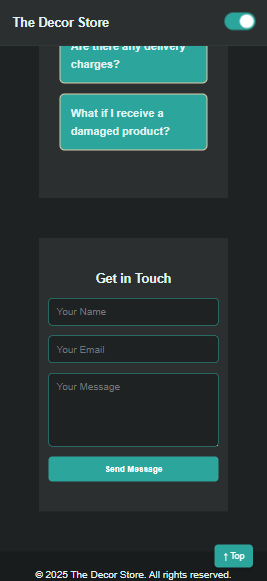

# task3

The Decor Store 
A responsive home decor store homepage built using HTML, CSS, and JavaScript. This project focuses on enhancing user experience with interactive features such as a hamburger menu, theme toggle, expandable FAQs, and a scroll-triggered "Back to Top" button. All elements are designed to work seamlessly across desktop and mobile devices.

---

# Live Demo

[🔗 View Live](https://your-live-demo-link-here.com)

---

# Screenshots

### Desktop View

### Mobile View

---

